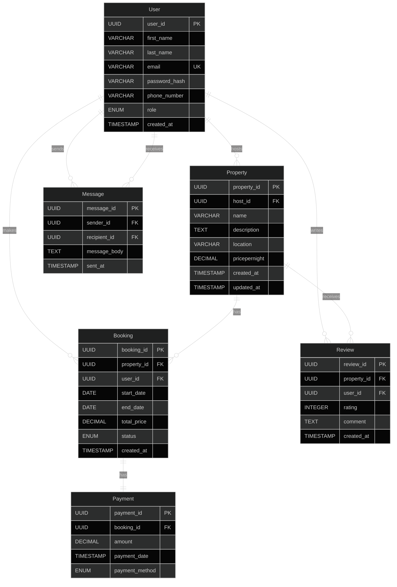

# AirBnB Clone Database - Entity-Relationship Diagram

## Table of Contents

1. [Introduction](#introduction)
2. [Entities and Attributes](#entities-and-attributes)
3. [Relationships](#relationships)
4. [Visual Representations](#visual-representations)
   - [Mermaid ER Diagram](#mermaid-er-diagram)
   - [ASCII ER Diagram](#ascii-er-diagram)
5. [Database Constraints](#constraints)
6. [Indexing Strategy](#indexing)
7. [Summary](#summary)

## Introduction

This document outlines the database design for an AirBnB clone application. The database is designed to support core functionalities such as user management, property listings, bookings, payments, reviews, and messaging between users. The Entity-Relationship (ER) diagram illustrates the structure and relationships between different entities in the system.

## Entities and Attributes

### User

- **user_id**: Primary Key (PK), UUID, Indexed
- **first_name**: VARCHAR, NOT NULL
- **last_name**: VARCHAR, NOT NULL
- **email**: VARCHAR, UNIQUE (UK), NOT NULL
- **password_hash**: VARCHAR, NOT NULL
- **phone_number**: VARCHAR, NULL
- **role**: ENUM (guest, host, admin), NOT NULL
- **created_at**: TIMESTAMP, DEFAULT CURRENT_TIMESTAMP

### Property

- **property_id**: Primary Key (PK), UUID, Indexed
- **host_id**: Foreign Key (FK), references User(user_id)
- **name**: VARCHAR, NOT NULL
- **description**: TEXT, NOT NULL
- **location**: VARCHAR, NOT NULL
- **pricepernight**: DECIMAL, NOT NULL
- **created_at**: TIMESTAMP, DEFAULT CURRENT_TIMESTAMP
- **updated_at**: TIMESTAMP, ON UPDATE CURRENT_TIMESTAMP

### Booking

- **booking_id**: Primary Key (PK), UUID, Indexed
- **property_id**: Foreign Key (FK), references Property(property_id)
- **user_id**: Foreign Key (FK), references User(user_id)
- **start_date**: DATE, NOT NULL
- **end_date**: DATE, NOT NULL
- **total_price**: DECIMAL, NOT NULL
- **status**: ENUM (pending, confirmed, canceled), NOT NULL
- **created_at**: TIMESTAMP, DEFAULT CURRENT_TIMESTAMP

### Payment

- **payment_id**: Primary Key (PK), UUID, Indexed
- **booking_id**: Foreign Key (FK), references Booking(booking_id)
- **amount**: DECIMAL, NOT NULL
- **payment_date**: TIMESTAMP, DEFAULT CURRENT_TIMESTAMP
- **payment_method**: ENUM (credit_card, paypal, stripe), NOT NULL

### Review

- **review_id**: Primary Key (PK), UUID, Indexed
- **property_id**: Foreign Key (FK), references Property(property_id)
- **user_id**: Foreign Key (FK), references User(user_id)
- **rating**: INTEGER, CHECK: rating >= 1 AND rating <= 5, NOT NULL
- **comment**: TEXT, NOT NULL
- **created_at**: TIMESTAMP, DEFAULT CURRENT_TIMESTAMP

### Message

- **message_id**: Primary Key (PK), UUID, Indexed
- **sender_id**: Foreign Key (FK), references User(user_id)
- **recipient_id**: Foreign Key (FK), references User(user_id)
- **message_body**: TEXT, NOT NULL
- **sent_at**: TIMESTAMP, DEFAULT CURRENT_TIMESTAMP

## Relationships

1. **User hosts Property**: One-to-Many

   - A User (as a host) can list multiple Properties.

2. **User makes Booking**: One-to-Many

   - A User can make multiple Bookings.

3. **Property has Booking**: One-to-Many

   - A Property can have multiple Bookings.

4. **Booking has Payment**: One-to-One

   - Each Booking has exactly one Payment.

5. **User writes Review**: One-to-Many

   - A User can write multiple Reviews.

6. **Property receives Review**: One-to-Many

   - A Property can receive multiple Reviews.

7. **User sends Message**: One-to-Many

   - A User can send multiple Messages.

8. **User receives Message**: One-to-Many
   - A User can receive multiple Messages.

## Visual Representations

### Mermaid ER Diagram



### ASCII ER Diagram

```
+----------------+       +----------------+       +----------------+
|      User      |       |    Property    |       |    Booking     |
+----------------+       +----------------+       +----------------+
| user_id (PK)   |<----->| property_id(PK)|<----->| booking_id (PK)|
| first_name     |   1:N | host_id (FK)   |   1:N | property_id(FK)|
| last_name      |       | name           |       | user_id (FK)   |
| email (UK)     |       | description    |       | start_date     |
| password_hash  |       | location       |       | end_date       |
| phone_number   |       | pricepernight  |       | total_price    |
| role           |       | created_at     |       | status         |
| created_at     |       | updated_at     |       | created_at     |
+----------------+       +----------------+       +----------------+
       ^                        ^                        |
       |                        |                        |
       | 1:N                    | 1:N                    | 1:1
       |                        |                        v
+----------------+       +----------------+       +----------------+
|    Message     |       |     Review     |       |    Payment     |
+----------------+       +----------------+       +----------------+
| message_id (PK)|       | review_id (PK) |       | payment_id (PK)|
| sender_id (FK) |       | property_id(FK)|       | booking_id (FK)|
| recipient_id(FK|       | user_id (FK)   |       | amount         |
| message_body   |       | rating         |       | payment_date   |
| sent_at        |       | comment        |       | payment_method |
+----------------+       | created_at     |       +----------------+
                         +----------------+
```

#### Legend:

- PK = Primary Key
- FK = Foreign Key
- UK = Unique Key
- 1:N = One-to-Many relationship
- 1:1 = One-to-One relationship

## Constraints

### User Table

- Unique constraint on email (UK).
- Non-null constraints on required fields.

### Property Table

- Foreign key constraint on host_id.
- Non-null constraints on essential attributes.

### Booking Table

- Foreign key constraints on property_id and user_id.
- Status must be one of pending, confirmed, or canceled.

### Payment Table

- Foreign key constraint on booking_id, ensuring payment is linked to valid Bookings.

### Review Table

- Constraints on rating values (1-5).
- Foreign key constraints on property_id and user_id.

### Message Table

- Foreign key constraints on sender_id and recipient_id.

## Indexing

- Primary Keys (PK): Indexed automatically.
- Additional Indexes:
  - Email in the User table.
  - property_id in the Property and Booking tables.
  - booking_id in the Booking and Payment tables.

## Summary

This database design for the AirBnB clone application consists of six main entities: User, Property, Booking, Payment, Review, and Message. The design supports the core functionalities of the application, including:

1. User management with different roles (guest, host, admin)
2. Property listings by hosts
3. Booking management with status tracking
4. Payment processing
5. Review and rating system
6. Messaging between users

The relationships between these entities are carefully designed to maintain data integrity and support efficient querying. Key features of the design include:

- UUID Primary Keys (PK) for all entities
- Unique Keys (UK) for fields like email
- Appropriate Foreign Key (FK) constraints
- Indexing strategy for performance optimization
- Timestamp tracking for created and updated records
- Enumerated types for status and role fields

This database structure provides a solid foundation for building a scalable and maintainable AirBnB clone application.
