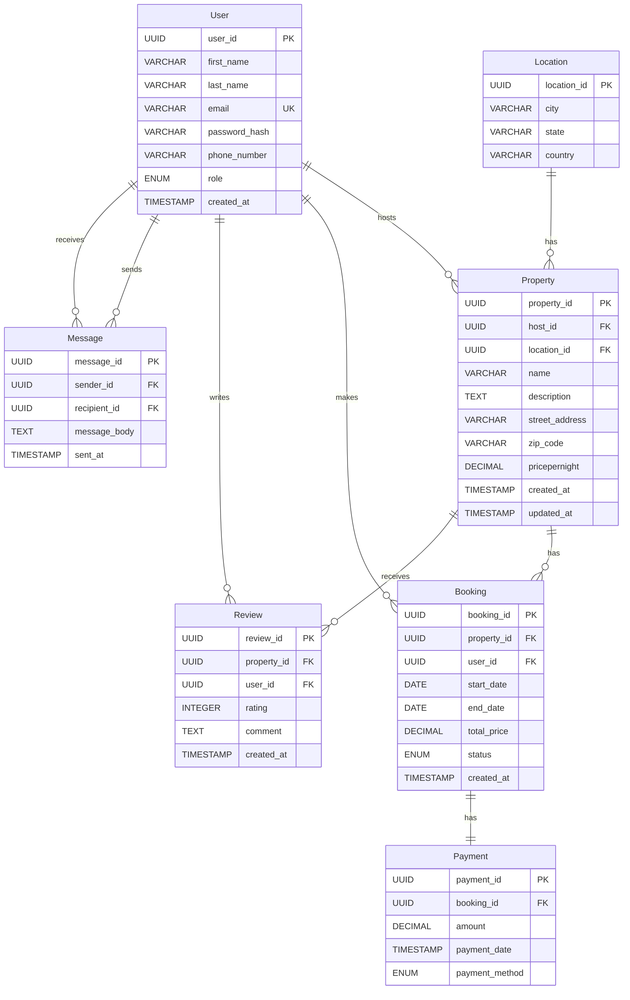

# Database Normalization Process

This document explains the normalization process applied to the AirBnB clone database schema to ensure it meets the Third Normal Form (3NF) requirements.

## Understanding Database Normalization

Database normalization is a systematic approach to organizing data in a relational database to minimize redundancy and dependency issues. The process involves progressively applying a series of rules (normal forms) to achieve an optimal database structure.

### Normal Forms

1. **First Normal Form (1NF)**: Eliminates repeating groups and ensures atomic values
2. **Second Normal Form (2NF)**: Meets 1NF requirements and removes partial dependencies
3. **Third Normal Form (3NF)**: Meets 2NF requirements and removes transitive dependencies

## Initial Schema Analysis

Let's analyze our initial database schema to identify any normalization issues:

### User Table

- user_id (PK)
- first_name
- last_name
- email (UK)
- password_hash
- phone_number
- role
- created_at

### Property Table

- property_id (PK)
- host_id (FK to User)
- name
- description
- location
- pricepernight
- created_at
- updated_at

### Booking Table

- booking_id (PK)
- property_id (FK to Property)
- user_id (FK to User)
- start_date
- end_date
- total_price
- status
- created_at

### Payment Table

- payment_id (PK)
- booking_id (FK to Booking)
- amount
- payment_date
- payment_method

### Review Table

- review_id (PK)
- property_id (FK to Property)
- user_id (FK to User)
- rating
- comment
- created_at

### Message Table

- message_id (PK)
- sender_id (FK to User)
- recipient_id (FK to User)
- message_body
- sent_at

## Normalization Process

### First Normal Form (1NF)

A table is in 1NF if:

- It has a primary key
- All columns contain atomic (indivisible) values
- No repeating groups

**Analysis:**

- All tables have primary keys (user_id, property_id, booking_id, payment_id, review_id, message_id)
- All columns contain atomic values
- No repeating groups are present

**Potential Issue:**

- The `location` field in the Property table might contain composite information (address, city, state, country, zip code)

**Solution:**
To ensure 1NF compliance, we should decompose the `location` field into atomic components:

```
Property Table (1NF)
- property_id (PK)
- host_id (FK to User)
- name
- description
- street_address
- city
- state
- country
- zip_code
- pricepernight
- created_at
- updated_at
```

### Second Normal Form (2NF)

A table is in 2NF if:

- It is in 1NF
- All non-key attributes are fully functionally dependent on the primary key

**Analysis:**

- User Table: All attributes depend on user_id (PK)
- Property Table: All attributes depend on property_id (PK)
- Booking Table: All attributes depend on booking_id (PK)
- Payment Table: All attributes depend on payment_id (PK)
- Review Table: All attributes depend on review_id (PK)
- Message Table: All attributes depend on message_id (PK)

**Potential Issue:**

- In the Booking table, `total_price` might be calculated from `pricepernight` (from Property) and the duration between `start_date` and `end_date`

**Solution:**
Since `total_price` is a calculated field that depends on the property's price and booking duration, we could consider it a derived attribute. However, storing it directly in the Booking table is beneficial for:

1. Historical record (property prices might change)
2. Performance (avoiding recalculation)
3. Accommodating special pricing or discounts

Therefore, we'll keep it in the Booking table, but document that it's a calculated field based on property price and booking duration.

### Third Normal Form (3NF)

A table is in 3NF if:

- It is in 2NF
- No non-key attribute is transitively dependent on the primary key

**Analysis:**

- User Table: No transitive dependencies
- Property Table: No transitive dependencies
- Booking Table: No transitive dependencies
- Payment Table: No transitive dependencies
- Review Table: No transitive dependencies
- Message Table: No transitive dependencies

**Potential Issue:**

- The `location` information in the Property table (after 1NF decomposition) might benefit from further normalization if many properties share the same city, state, country

**Solution:**
To eliminate potential transitive dependencies related to location data, we can create separate tables for location information:

```
Location Table
- location_id (PK)
- city
- state
- country

Property Table (3NF)
- property_id (PK)
- host_id (FK to User)
- location_id (FK to Location)
- name
- description
- street_address
- zip_code
- pricepernight
- created_at
- updated_at
```

## Progression from 1NF to 3NF

The following table summarizes the progression of our database schema through the normalization process:

| Normal Form | Changes Applied                                                                                     | Benefits                                                      |
| ----------- | --------------------------------------------------------------------------------------------------- | ------------------------------------------------------------- |
| **1NF**     | Decomposed `location` field into atomic components (street_address, city, state, country, zip_code) | Ensures all values are atomic and eliminates repeating groups |
| **2NF**     | Verified all non-key attributes are fully dependent on their primary keys                           | Eliminates partial dependencies                               |
| **3NF**     | Created separate Location table for city, state, country data                                       | Eliminates transitive dependencies                            |

## Final Normalized Schema

After applying normalization principles, our final schema is:

### User Table (3NF)

- user_id (PK)
- first_name
- last_name
- email (UK)
- password_hash
- phone_number
- role
- created_at

### Location Table (3NF)

- location_id (PK)
- city
- state
- country

### Property Table (3NF)

- property_id (PK)
- host_id (FK to User)
- location_id (FK to Location)
- name
- description
- street_address
- zip_code
- pricepernight
- created_at
- updated_at

### Booking Table (3NF)

- booking_id (PK)
- property_id (FK to Property)
- user_id (FK to User)
- start_date
- end_date
- total_price
- status
- created_at

### Payment Table (3NF)

- payment_id (PK)
- booking_id (FK to Booking)
- amount
- payment_date
- payment_method

### Review Table (3NF)

- review_id (PK)
- property_id (FK to Property)
- user_id (FK to User)
- rating
- comment
- created_at

### Message Table (3NF)

- message_id (PK)
- sender_id (FK to User)
- recipient_id (FK to User)
- message_body
- sent_at

## Visual Representation of the Normalized Schema



## Conclusion

The database schema for the AirBnB clone application has been normalized to the Third Normal Form (3NF). The main changes made during the normalization process were:

1. Decomposing the `location` field in the Property table into atomic components (1NF)
2. Creating a separate Location table to eliminate transitive dependencies (3NF)

These changes ensure that the database schema:

- Minimizes data redundancy
- Reduces update anomalies
- Maintains data integrity
- Provides a flexible structure for future enhancements

The normalized schema maintains all the functional requirements of the original design while improving its structural integrity according to database normalization principles.
